# Sample Input Images
The images in this folder are cherry picked samples that work well with the pre-trained CycleGAN models and are included here to be used as inputs in the Colab inference demo. All images were pulled from Unsplash.com. Thank you to the contributors below for making these images available.

## **horse2zebra**
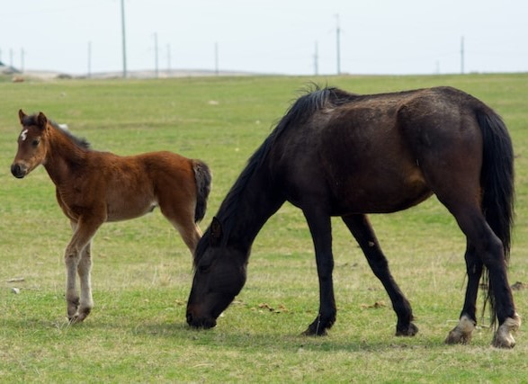

credit [Aleksei Zaitcev](https://unsplash.com/@laowai66)

 

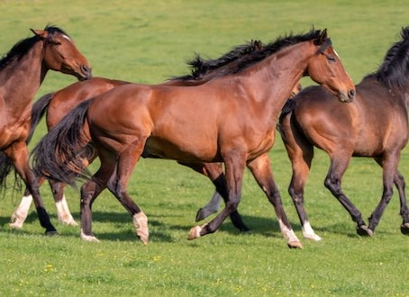

credit [Brendon van Zyl](https://unsplash.com/@brendonvzyl)

 

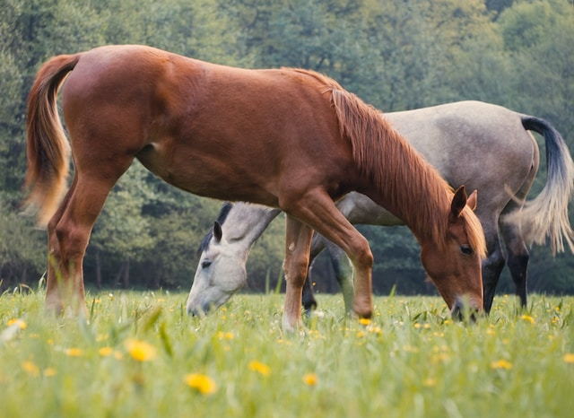

credit [Immo Wegmann](https://unsplash.com/@macroman)

  

## **zebra2horse**
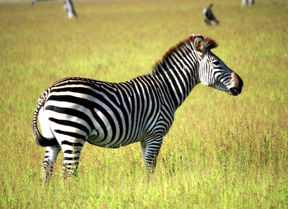

credit [Henning Borgersen](https://unsplash.com/@hebo79)

 

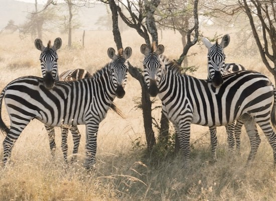

credit [Matteo Di Iorio](https://unsplash.com/@shot_by_teo)

 

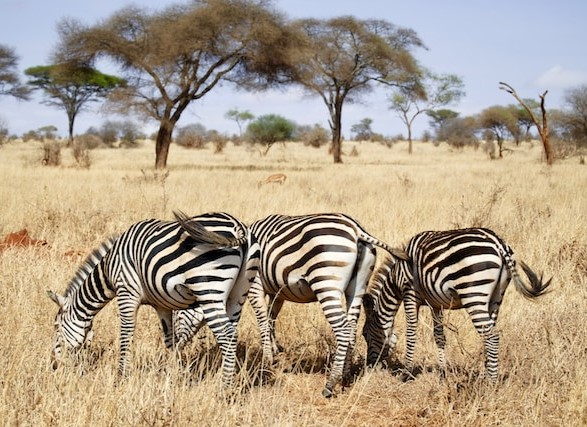

credit [Ray Rui](https://unsplash.com/@ray30)

 

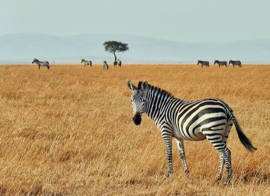

credit [Ron Dauphin](https://unsplash.com/@rondomondo)

 

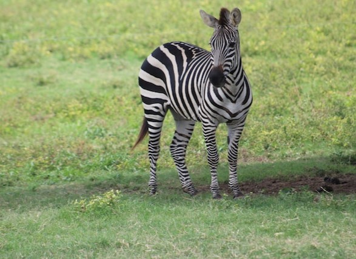

credit [Sandra Gabriel](https://unsplash.com/@sandragabriel)

 

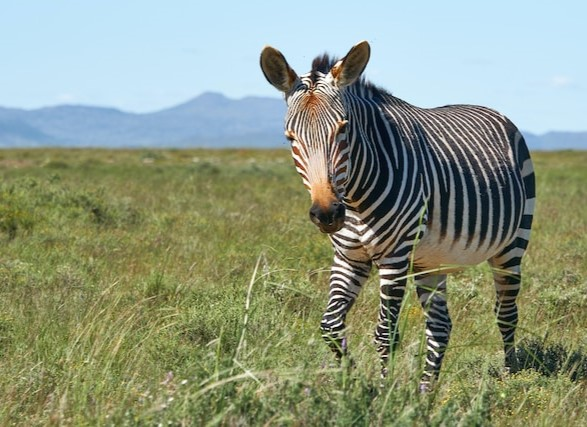

credit [Wolfgang Hasselmann](https://unsplash.com/@wolfgang_hasselmann)

  

## **monet2photo**
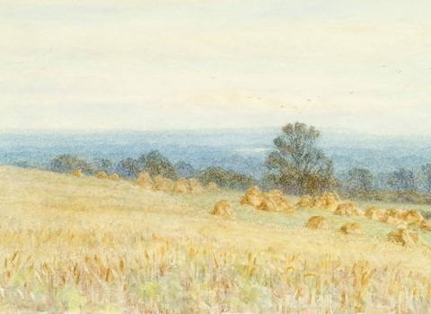

credit [Birmingham Museums Trust](https://unsplash.com/@birminghammuseumstrust)

 

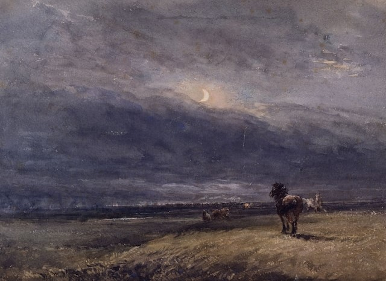

credit [Birmingham Museums Trust](https://unsplash.com/@birminghammuseumstrust)

 

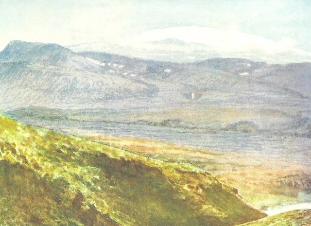

credit [British Library](https://unsplash.com/@britishlibrary)

  

## **photo2monet**
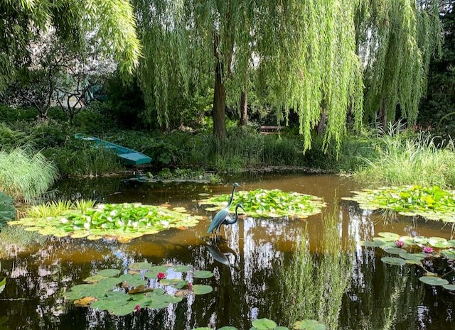

credit [Carrie Borden](https://unsplash.com/@carrie_borden)

 

credit [Raphael Lopes](https://unsplash.com/@raph_lopes)

 

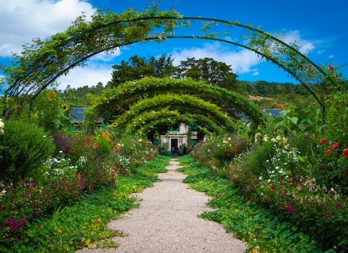

credit [Veronica Reverse](https://unsplash.com/@vereverse)

 

